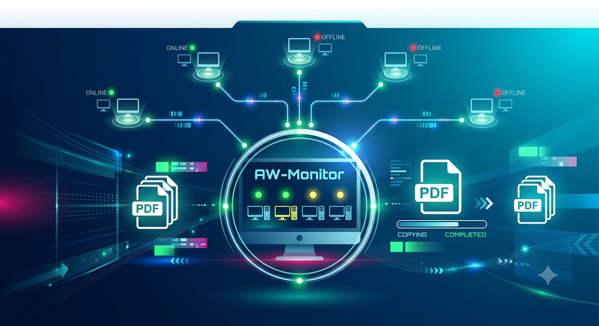

# AW Monitor

Operations monitoring dashboard for the AmericaWorks PDF backup pipeline. Tracks PC health, backup run results, and scan statistics across 24 lab PCs in real time.

## What It Does

AW Monitor provides live visibility into a daily PDF assessment backup workflow:

- **PC Health Monitoring** — 4-tier probes (ICMP ping, SMB port, admin share auth, folder access) run on a schedule across 24 lab PCs, with real-time status pushed via WebSocket
- **Backup Run Tracking** — Receives webhook summaries from the PowerShell backup script: files copied, skipped, duplicates, duration, failures
- **Scan Statistics** — Polls the existing Express.js API for file counts, storage usage, and trends over time
- **Encrypted Config Store** — AES-256 Fernet-encrypted key-value store for SMB credentials, check intervals, and notification settings
- **Auth & RBAC** — RS256 JWT authentication with 4-tier role hierarchy (Super Admin > Admin > Manager > User), session management, password history, and account lockout

## Architecture

```
┌─────────────────────┐
│  24 Lab PCs         │
│  192.168.72.x       │
└────────┬────────────┘
         │ SMB probe (every 5-15 min)
         ▼
┌─────────────────────────────────────────────┐
│  AW Monitor (FastAPI)                       │
│                                             │
│  ┌──────────┐ ┌───────────┐ ┌────────────┐ │
│  │ Health   │ │ Ingestion │ │ Config     │ │
│  │ Monitor  │ │ Service   │ │ Store      │ │
│  └────┬─────┘ └─────┬─────┘ └─────┬──────┘ │
│       │             │              │        │
│       ▼             ▼              ▼        │
│  ┌─────────────┐          ┌──────────────┐  │
│  │ Supabase PG │          │ AES-256      │  │
│  │ (PostgreSQL)│          │ Encrypted    │  │
│  └─────────────┘          └──────────────┘  │
│       │                                     │
│  ┌────┴──────────────────┐                  │
│  │ Auth (JWT RS256+RBAC) │                  │
│  └───────────────────────┘                  │
└──────────────┬──────────────────────────────┘
               │
         ┌─────┴──────┐
         │ WebSocket  │ (PC health, real-time)
         │ REST API   │ (scan data, 30s polling)
         └─────┬──────┘
               ▼
┌──────────────────────────┐
│  Next.js Frontend        │
│  Tailwind + shadcn/ui    │
└──────────────────────────┘
```

## Tech Stack

### Backend
- Python 3.11+, FastAPI, Uvicorn
- SQLAlchemy (async) + asyncpg
- Alembic migrations
- bcrypt, python-jose (RS256), cryptography (Fernet)
- smbprotocol, httpx

### Frontend
- Next.js 14 (App Router)
- Tailwind CSS + shadcn/ui (custom dark theme)
- TanStack Query, Recharts, Zustand

### Database
- Self-hosted Supabase (PostgreSQL only)

## Getting Started

### Prerequisites
- Python 3.11+
- Node.js 18+
- PostgreSQL (via Supabase or standalone)

### Backend

```bash
cd backend
cp .env.example .env
# Edit .env with your database URL and encryption key

# Generate RSA keys for JWT
mkdir keys
openssl genrsa -out keys/private.pem 2048
openssl rsa -in keys/private.pem -pubout -out keys/public.pem

pip install -e ".[dev]"
alembic -c migrations/alembic.ini upgrade head
uvicorn app.main:app --port 8000
```

### Frontend

```bash
cd frontend
npm install
npm run dev
```

The frontend runs at `http://localhost:3000` and the API at `http://localhost:8000`.

## Network Context

| Resource | Address |
|----------|---------|
| Lab PCs | PC1–PC24, 192.168.72.37–192.168.72.100 |
| File Server | 192.168.70.10 |
| Share Path | `\\192.168.70.10\Client_Assessments` |

## License

Private — internal use only.
